# NatureForward-MapData

This repository is for Nature Forward to convert their Salesforce data into usable data for ArcGis.

**Old Map**: https://natureforward.my.salesforce-sites.com/enterWQMSession/displaymapmostrecentwqm

**Note:** Do NOT save the notebooks after running. If this pop-up displays after running a notebook, click LEAVE.
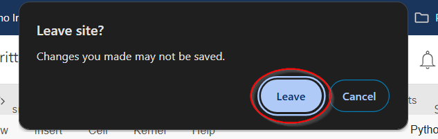

After running a notebook, you can check the `Modified` column on the ArcGIS Online [Content](https://anshome.maps.arcgis.com/home/content.html?sortField=modified&sortOrder=desc&view=table&folder=6c942c2f53de4053ad864e756ff9484d#my) page, to see if the notebooks updated to today's date.  
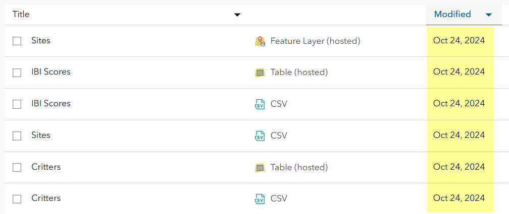

 
 

Quick Links:  
[Updating Sites Feature Layer](#1-updating-sites-featurelayer)  
[Updating Critters Table](#2-updating-critters-table)  
[Updating IBI Scores Table](#3-updating-ibi-scores-table)

# 1. Updating Sites FeatureLayer

This report only needs to be run when a new site is added or site details are changed (coordinates, name, etc).

## 1.1 Download `LimnoTech Sites` Report

Navigate to the [`Reports`](https://natureforward.my.salesforce.com/00O/o) tab on Salesforce. Under the **LimnoTech** folder there is a report titled [`LimnoTech Sites`](https://natureforward.my.salesforce.com/00OUw000001pS05).

Click `Run Report` and then click `Export Details`.  
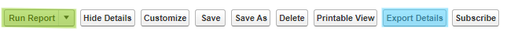

Change to the following export settings and then click `Export`.

- **Export File Encoding** = `Unicode (UTF-8)`
- **Export File Format** = `Comma Delimited .csv`

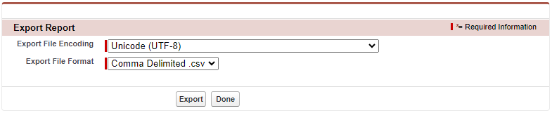

Your file will then download to your browser. The file name will be similar to **_report1719589800854.csv_**, but with different numbers.

## 1.2 Run the ArcGIS Online Jupyter Notebook

Under the [Notebook](https://anshome.maps.arcgis.com/home/notebook/notebookhome.html) tab in ArcGIS online, open the [Update Sites FeatureLayer]() notebook.

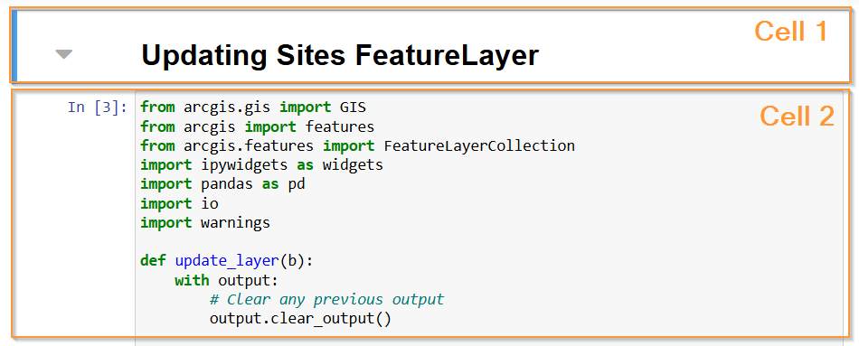

Click on cell with code (Cell 2) and then click `Run`. While the cell is running, it will have this symbol `In [*]`, once finished it will change to `In [1]`.  
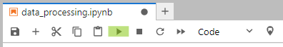

Scroll to the bottom of the notebook and click the `Upload` button. Upload the report you downloaded in [Step 1](#11-download-limnotech-sites-report), then click `Update Layer`.  
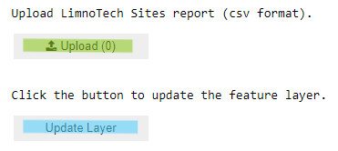

A progress bar will appear and update while the code is running. The layer is successfully updated when the progress bar reaches 100% and `Sites layer updated` is displayed.  
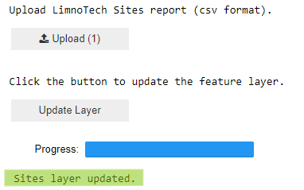

# 2. Updating Critters Table

This notebook should be run every time a map refresh occurs along with the [IBI Scores Notebook](#3-updating-ibi-scores-table).

## 2.1 Download `LimnoTech Session/Critter` Report

Navigate to the [`Reports`](https://natureforward.my.salesforce.com/00O/o) tab on Salesforce. Under the **LimnoTech** folder there is a report titled [`LimnoTech Session/Critter`](https://natureforward.my.salesforce.com/00OUw000001htqH).

In the `Time Frame` box, change the `From` date to 3 years prior (ex: 1/1/2022 -> 1/1/2019). This change will capture the last 5 years of critter data.  
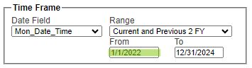

Click `Run Report` and then click `Export Details`.  

Change to the following export settings and then click `Export`.

- **Export File Encoding** = `Unicode (UTF-8)`
- **Export File Format** = `Comma Delimited .csv`

Your file will then download to your browser. The file name will be similar to **_report1719589800854.csv_**, but with different numbers.

## 2.2 Run the ArcGIS Online Jupyter Notebook

Under the [Notebook](https://anshome.maps.arcgis.com/home/notebook/notebookhome.html) tab in ArcGIS online, open the [Update Critters Table](https://anshome.maps.arcgis.com/home/notebook/notebook.html?id=c49b75f26cd945b4bcf5e3faa6f7e858) notebook.

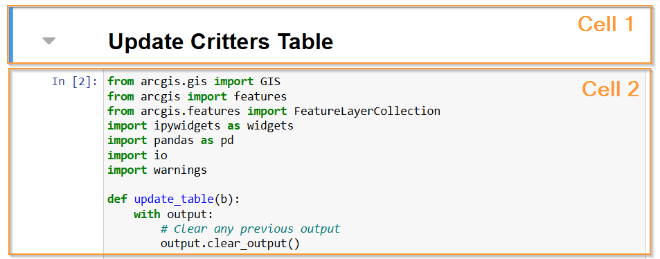

Click on the cell with code (Cell 2) and then click `Run`. While the cell is running, it will have this symbol `In [*]`, once finished it will change to `In [1]`.  

Scroll to the bottom of the notebook and click the `Upload` button. Upload the report you downloaded in [Step 1](#11-download-limnotech-sites-report), then click `Update Table`.  
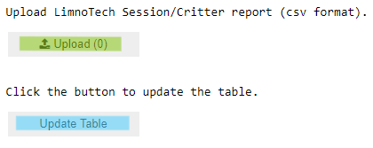

A progress bar will appear and update while the code is running. The layer is successfully updated when the progress bar reaches 100% and `Critters table updated` is displayed.  
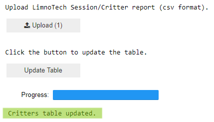

# 3. Updating IBI Scores Table

This notebook should be run every time a map refresh occurs along with the [Critters Notebook](#2-updating-critters-table).

## 3.1. Download `LimnoTech IBI Over Time` Report

Navigate back to the [`Reports`](https://natureforward.my.salesforce.com/00O/o) tab on Salesforce. Under the **LimnoTech** folder there is a report titled [`LimnoTech IBI Over Time`](https://natureforward.my.salesforce.com/00OUw000001huj7).

Click `Run Report` and then click `Export Details`.  

Change to the following export settings and then click `Export`.

- **Export File Encoding** = `Unicode (UTF-8)`
- **Export File Format** = `Comma Delimited .csv`

Your file will then download to your browser. The file name will be similar to **_report1719589800854.csv_**, but with different numbers.

## 3.2 Run the ArcGIS Online Jupyter Notebook

Under the [Notebook](https://anshome.maps.arcgis.com/home/notebook/notebookhome.html) tab in ArcGIS online, open the [Update IBI Scores Table](https://anshome.maps.arcgis.com/home/notebook/notebook.html?id=bb8de15473674581ada5d5ed64b019d5) notebook.

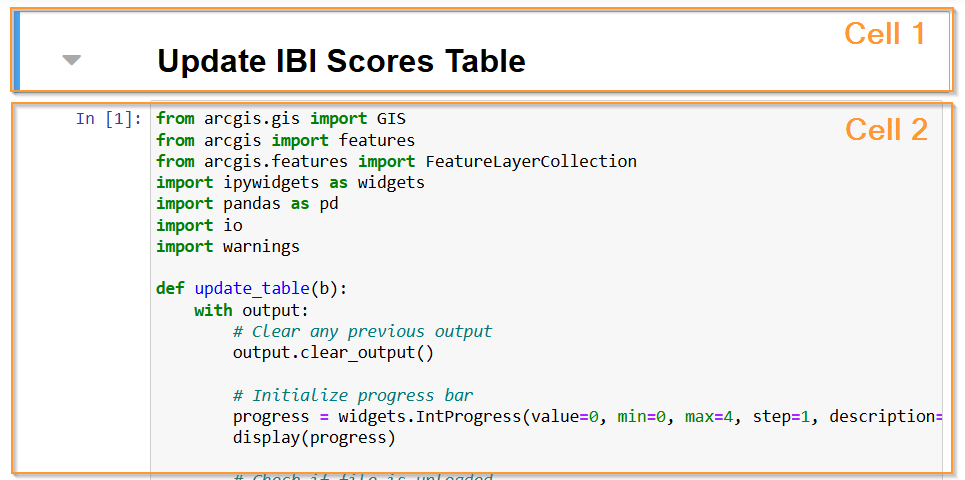

Click on the cell with code (Cell 2) and then click `Run`. While the cell is running, it will have this symbol `In [*]`, once finished it will change to `In [1]`.  

Scroll to the bottom of the notebook and click the `Upload` button. Upload the report you downloaded in [Step 1](#11-download-limnotech-sites-report), then click `Update Table`.  
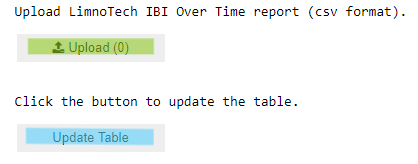

A progress bar will appear and update while the code is running. The layer is successfully updated when the progress bar reaches 100% and `IBI Scores table updated` is displayed.  
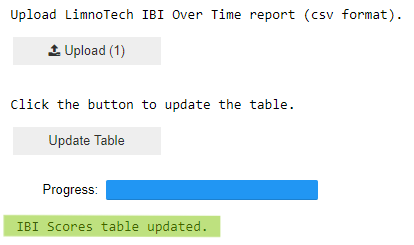

## NEW STEP: Add "Score" column to IBI Table

On ArcGIS Online, navigate to the [IBI Scores](https://anshome.maps.arcgis.com/home/item.html?id=fd3ee2281add485bbb2332bd52488969) Table (hosted). Click on `Data` in the blue navigation bar.

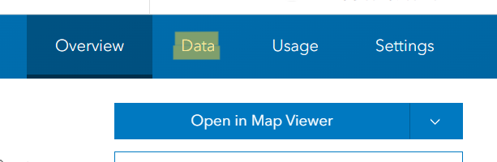

Click on `Fields` in the upper right-hand of the page. Then clik the large `+ Add` button on the left.

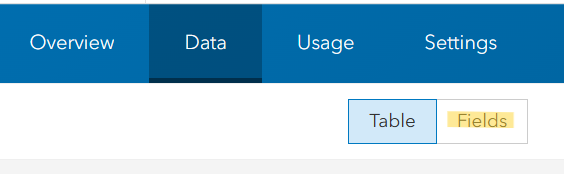  
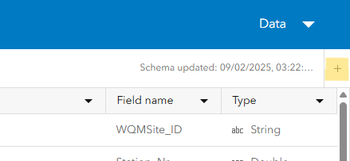 

On the "Add Field" popup, write `Score` in for "Field Name" and change "Type" to `Integer`. Then click `Add New Field`.

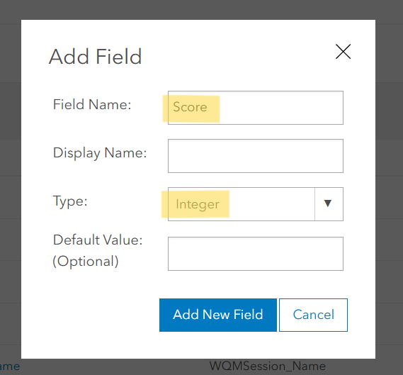 

