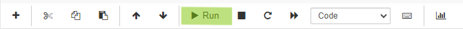

# NatureForward-MapData
This repository is for Nature Forward to convert their Salesforce data into usable data for ArcGis.

**Old Map**: https://natureforward.my.salesforce-sites.com/enterWQMSession/displaymapmostrecentwqm

 
 

# **Refreshing WQM ArcGIS Map Data:**

## 1. Download `LimnoTech Session/Critter` Report
Navigate to the [`Reports`](https://natureforward.my.salesforce.com/00O/o) tab on Salesforce. Under the **LimnoTech** folder there is a report titled [`LimnoTech Session/Critter`](https://natureforward.my.salesforce.com/00OUw000001htqH).

  
Click `Run Report` and then click `Export Details`.  

 
Change to the following export settings and then click `Export`.
- **Export File Encoding** = `Unicode (UTF-8)` 
- **Export File Format** = `Comma Delimited .csv` 

Your file will then download to your browser. The file name will be similar to ***report1719589800854.csv***, but with different numbers.

## 2. Download the Jupyter Notebook
Navigate to the [data_processing.ipynb](https://github.com/LimnoTech/NatureForward-MapData/blob/main/data_processing.ipynb) notebook. Click the 3 dots in the right corner and selected **Download**. The downloaded file will be named `data_processing.ipynb`.

## 3. Running the Notebook
Navigate to [JupyterLab](https://jupyter.org/try-jupyter/lab/). Click the upload button located in the upper left hand side of the page and upload the `data_processing.ipynb` file.   

The notebook will now be located in your Jupyter files. Open up the notebook by double clicking it.   

To run the notebook click the arrow located in the toolbar. While the notebook is running, the cell will have this symbol `[*]`, once finished it will change to `[1]`.  

Scroll to the bottom of the notebook and click the `Upload` button. Upload the report you downloaded in [Step 1](#1-download-limnotech-sessioncritter-report), then click `Transform Data`.  

Once the data has been processed, text saying `Newest sessions for each site saved to new_data.csv` will appear.  

## 4. Download New Data
The new data will now show up in the Jupyter files as `new_data.csv`.

Right click the file, and click `Download`. The file will be saved as `new_data.csv`.

## 5. Download `LimnoTech IBI Over Time` Report
Navigate back to the [`Reports`](https://natureforward.my.salesforce.com/00O/o) tab on Salesforce. Under the **LimnoTech** folder there is a report titled [`LimnoTech IBI Over Time`](https://natureforward.my.salesforce.com/00OUw000001huj7).

  
Click `Run Report` and then click `Export Details`.  

 
Change to the following export settings and then click `Export`.
- **Export File Encoding** = `Unicode (UTF-8)` 
- **Export File Format** = `Comma Delimited .csv` 

Your file will then download to your browser. The file name will be similar to ***report1719589800854.csv***, but with different numbers.

## 6. TODO: Upload to ArcGIS
